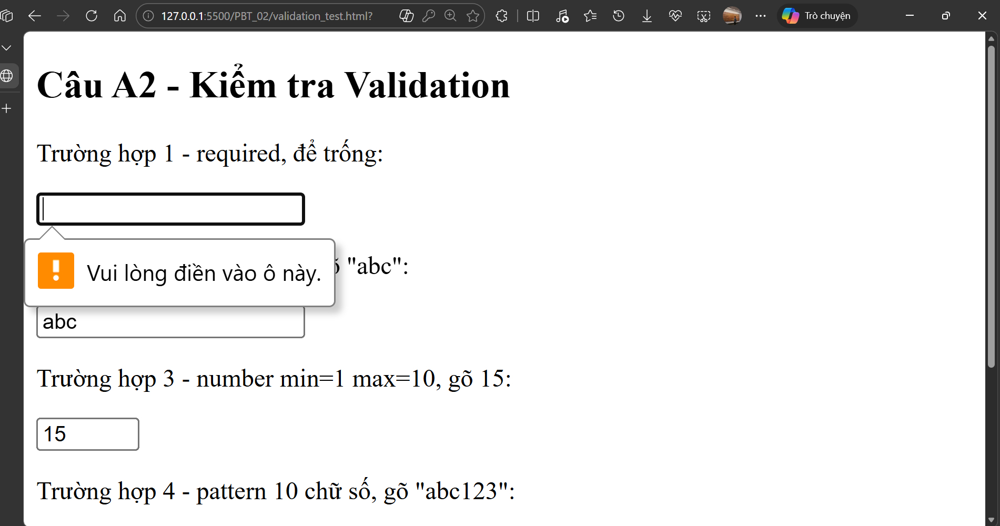
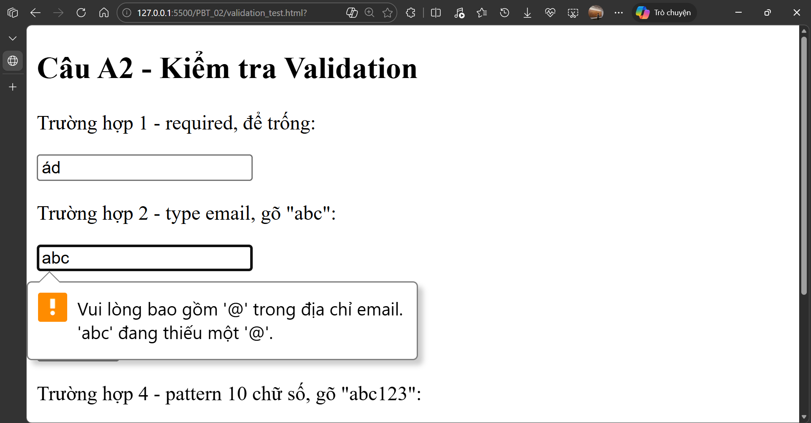
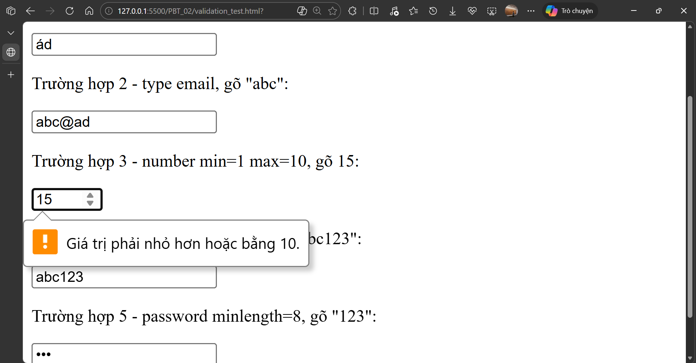
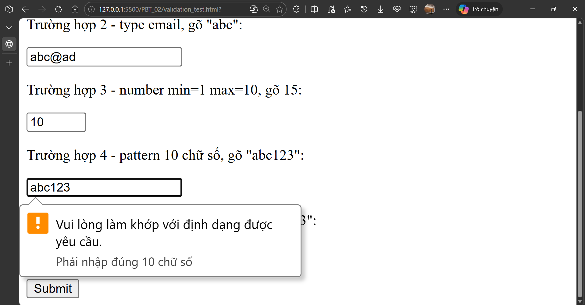
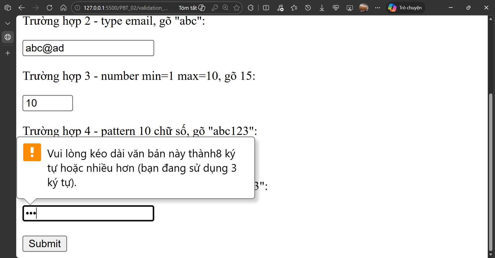

# PHẦN A - KIỂM TRA ĐỌC HIỂU

## Câu A1 - Input Types

**Nguồn tham chiếu:**
- `07_forms_interactive.md` — mục 3. Core Technical Truth > Tất cả Input Types HTML5

1. `type="email"` → ô nhập text thông thường, tự kiểm tra có ký tự `@` và domain hợp lệ → dùng cho form đăng ký, đăng nhập
2. `type="password"` → ô nhập text nhưng ký tự bị ẩn thành dấu chấm, validate được minlength và pattern → dùng cho ô tạo mật khẩu
3. `type="number"` → có nút tăng/giảm hai bên, validate được min/max/step → dùng cho ô nhập số lượng sản phẩm trong giỏ hàng
4. `type="tel"` → trên mobile hiện bàn phím số thay vì QWERTY, validate bằng pattern → dùng cho ô nhập số điện thoại khi đặt hàng
5. `type="date"` → hiện date picker của browser, validate min/max → dùng cho ô chọn ngày giao hàng mong muốn
6. `type="checkbox"` → ô chọn có/không, validate được required → dùng cho "Đồng ý điều khoản" hoặc chọn nhiều phương thức nhận thông báo
7. `type="radio"` → chọn một trong nhiều lựa chọn, cùng name thì chỉ chọn được 1 → dùng cho chọn phương thức thanh toán (COD / chuyển khoản / ví điện tử)
8. `type="file"` → mở hộp thoại chọn file, có thể lọc định dạng bằng accept, cho nhiều file bằng multiple → dùng cho upload ảnh sản phẩm khi bán hàng
9. `type="range"` → thanh kéo slider, validate min/max/step → dùng cho bộ lọc khoảng giá sản phẩm
10. `type="search"` → giống text nhưng có nút X để xóa nhanh → dùng cho ô tìm kiếm sản phẩm trên thanh header

---

## Câu A2 - Validation Attributes

**Nguồn tham chiếu:**
- `07_forms_interactive.md` — mục 3. Core Technical Truth > Validation Attributes

### Dự đoán trước khi chạy:

**Trường hợp 1:** `<input type="text" required value="">`
Browser sẽ chặn submit và hiện thông báo "Vui lòng điền vào trường này" vì có `required` mà giá trị đang trống.

**Trường hợp 2:** `<input type="email" value="abc">`
Browser chặn submit vì "abc" không có `@` nên không đúng format email. Thông báo kiểu "Vui lòng nhập địa chỉ email".

**Trường hợp 3:** `<input type="number" min="1" max="10" value="15">`
Browser chặn submit vì 15 vượt quá max="10", thông báo "Giá trị phải nhỏ hơn hoặc bằng 10".

**Trường hợp 4:** `<input type="text" pattern="[0-9]{10}" value="abc123">`
Browser chặn submit vì "abc123" không khớp pattern chỉ cho phép đúng 10 chữ số. Thông báo mặc định hoặc nội dung trong `title` nếu có.

**Trường hợp 5:** `<input type="password" minlength="8" value="123">`
Browser chặn submit vì "123" chỉ có 3 ký tự, không đủ minlength="8". Thông báo "Nhập ít nhất 8 ký tự".







---

## Câu A3 - Accessibility

**Nguồn tham chiếu:**
- `07_forms_interactive.md` — mục 3. Core Technical Truth > Accessibility — Form cho mọi người

### 1. Tại sao `<label for="email">` quan trọng cho screen reader?

Người dùng screen reader dùng phần mềm đọc màn hình để nghe nội dung trang web. Nếu input không có label kết nối đúng, phần mềm chỉ đọc "edit text" hoặc "text field" — người dùng không biết cần nhập gì vào ô đó. Khi có `<label for="email">` kết nối với `<input id="email">`, screen reader sẽ đọc "Email, edit text" — rõ ràng hơn nhiều. Ngoài ra còn giúp người dùng chuột bình thường click vào label để focus vào input, tiện hơn.

### 2. Khi nào dùng `<fieldset>` + `<legend>`?

Dùng để nhóm các input có liên quan với nhau, đặc biệt là nhóm radio buttons và checkboxes. Ví dụ:

```html
<fieldset>
    <legend>Phương thức thanh toán</legend>
    <label><input type="radio" name="payment" value="cod"> Thanh toán khi nhận hàng</label>
    <label><input type="radio" name="payment" value="bank"> Chuyển khoản</label>
    <label><input type="radio" name="payment" value="momo"> Ví MoMo</label>
</fieldset>
```

Nếu không có fieldset + legend, screen reader sẽ đọc từng radio một mà không biết chúng thuộc nhóm nào. Có legend thì sẽ đọc "Phương thức thanh toán, Thanh toán khi nhận hàng, radio button 1 of 3".

### 3. `aria-label` dùng khi nào?

`aria-label` dùng cho những phần tử không thể có label thông thường, ví dụ button chỉ có icon:

```html
<button type="submit" aria-label="Gửi đơn hàng">🛒</button>
```

Không nên dùng `aria-label` khi đã có `<label>` vì sẽ tạo ra hai mô tả cho cùng một input, screen reader có thể đọc cả hai gây nhầm lẫn. Nên chỉ dùng aria-label khi không có cách nào thêm label hiển thị được.

---

## Câu A4 - Media

**Nguồn tham chiếu:**
- `06_graphics_multimedia.md` — mục 3. Core Technical Truth > `` — Best Practices
- `06_graphics_multimedia.md` — mục 3. Core Technical Truth > Video & Audio

### 1. `loading="lazy"` là gì?

`loading="lazy"` làm cho ảnh chỉ được tải về khi user scroll gần đến vị trí ảnh đó trên trang. Mặc định browser sẽ tải tất cả ảnh ngay khi load trang dù ảnh có đang ở tầm nhìn hay không.

Lợi ích: trang load nhanh hơn vì chỉ tải ảnh cần thiết, tiết kiệm bandwidth cho user.

Không nên dùng khi: ảnh nằm ngay đầu trang (above the fold) như logo hay ảnh hero — những ảnh này user thấy ngay, nếu lazy load sẽ bị chậm hiển thị, ảnh hưởng đến LCP (Largest Contentful Paint).

### 2. Tại sao cần nhiều `<source>` trong `<video>`?

Vì mỗi browser hỗ trợ các format video khác nhau. Nếu chỉ có 1 format, user dùng browser không hỗ trợ sẽ không xem được video. Cung cấp nhiều source giúp browser tự chọn format phù hợp nhất với nó.

3 format video phổ biến trên web:
- **MP4** (video/mp4) — phổ biến nhất, hầu hết browser đều hỗ trợ
- **WebM** (video/webm) — nhẹ hơn MP4, Chrome và Firefox hỗ trợ tốt
- **OGG** (video/ogg) — cũ hơn, ít dùng

### 3. Thuộc tính `alt` dùng để làm gì?

`alt` cung cấp mô tả văn bản cho ảnh, dùng trong 2 trường hợp: khi ảnh lỗi không load được thì text alt hiện ra thay thế, và screen reader đọc nội dung alt để mô tả ảnh cho người khiếm thị.

Viết alt cho 3 trường hợp:

- Ảnh sản phẩm iPhone 16: `alt="iPhone 16 Pro Max 256GB màu Titan Tự Nhiên, mặt trước"`
- Ảnh trang trí: `alt=""` — để trống, screen reader sẽ bỏ qua ảnh này
- Biểu đồ doanh thu Q1/2026: `alt="Biểu đồ cột doanh thu Q1/2026, tháng 3 cao nhất đạt 4.2 tỷ đồng"`

---

## Câu A5 - `<figure>` vs ``

**Nguồn tham chiếu:**
- `06_graphics_multimedia.md` — mục 3. Core Technical Truth > `` — Best Practices
- `04_visible_part_html.md` — mục Semantic HTML5 — "Thẻ có ý nghĩa" > Bản đồ Semantic Elements

**Dùng `` đơn** khi ảnh chỉ là minh họa đơn thuần, không cần chú thích, không cần ngữ nghĩa thêm. Ví dụ:
- Icon nhỏ trong nav hoặc button
- Ảnh avatar người dùng trong comment

**Dùng `<figure>` + `<figcaption>`** khi ảnh có nội dung cần giải thích thêm, hoặc ảnh mang ngữ nghĩa độc lập có thể tách ra khỏi nội dung mà vẫn hiểu được. Ví dụ:
- Ảnh sản phẩm trong trang detail cần hiện tên và giá bên dưới
- Biểu đồ hoặc infographic cần caption mô tả dữ liệu

---

# PHẦN C - PHÂN TÍCH & SUY LUẬN

## Câu C1 - Debug Form

**Nguồn tham chiếu:**
- `07_forms_interactive.md` — mục 3. Core Technical Truth > Accessibility — Form cho mọi người

```html
<form>
    Tên: <input type="text">
    
    <input type="email" placeholder="Email của bạn">
    
    <input type="password" placeholder="Mật khẩu">
    <input type="password" placeholder="Nhập lại mật khẩu">
    
    Phone: <input type="text" value="0901234567">
    
    <select>
        <option>Hà Nội</option>
        <option>TP.HCM</option>
    </select>
    
    <label>
        Tôi đồng ý điều khoản
    </label>
    
    <input type="submit" value="Gửi">
</form>
```

---

**Lỗi 1:** `<form>` không có `action` và `method`
Sửa: `<form action="#" method="POST">`

---

**Lỗi 2:** Input "Tên" không có `<label>` kết nối, không có `id`, không có `name`, không có `required`
Sửa:
```html
<label for="name">Tên:</label>
<input type="text" id="name" name="name" required>
```

---

**Lỗi 3:** Input email không có `<label>`, không có `id`, không có `name`, không có `required` — chỉ có placeholder không đủ cho accessibility
Sửa:
```html
<label for="email">Email:</label>
<input type="email" id="email" name="email" required placeholder="Email của bạn">
```

---

**Lỗi 4:** Hai input password không có `<label>`, không có `id`, không có `name`
Sửa:
```html
<label for="password">Mật khẩu:</label>
<input type="password" id="password" name="password" required placeholder="Mật khẩu">

<label for="confirm-password">Nhập lại mật khẩu:</label>
<input type="password" id="confirm-password" name="confirm_password" required placeholder="Nhập lại mật khẩu">
```

---

**Lỗi 5:** Input phone dùng `type="text"` thay vì `type="tel"`, không có `<label>`, không có `id`, không có `name`, không có `pattern`
Sửa:
```html
<label for="phone">Số điện thoại:</label>
<input type="tel" id="phone" name="phone" pattern="[0-9]{10}" placeholder="0901234567">
```

---

**Lỗi 6:** `<select>` không có `<label>`, không có `id`, không có `name`
Sửa:
```html
<label for="city">Thành phố:</label>
<select id="city" name="city">
    <option value="">-- Chọn thành phố --</option>
    <option value="hanoi">Hà Nội</option>
    <option value="hcm">TP.HCM</option>
</select>
```

---

**Lỗi 7:** `<label>` "Tôi đồng ý điều khoản" không kết nối với bất kỳ input nào — thiếu checkbox bên trong hoặc `for` attribute
Sửa:
```html
<label>
    <input type="checkbox" name="agree" required>
    Tôi đồng ý điều khoản
</label>
```

---

**Lỗi 8:** Dùng `<input type="submit">` thay vì `<button type="submit">` — không sai hoàn toàn nhưng `<button>` linh hoạt hơn và là best practice hiện đại
Sửa:
```html
<button type="submit">Gửi</button>
```

---

## Câu C2 - Thiết kế chiến lược Validation

**Nguồn tham chiếu:**
- `07_forms_interactive.md` — mục 3. Core Technical Truth > Validation Attributes
- `07_forms_interactive.md` — mục 7. Common Misconceptions — Hiểu sai phổ biến

### 1. Pattern regex cho CMND/CCCD và Số tài khoản:

CMND/CCCD đúng 12 chữ số:
```html
<input type="text" pattern="[0-9]{12}" title="CMND/CCCD phải đúng 12 chữ số">
```

Số tài khoản 10-15 chữ số:
```html
<input type="text" pattern="[0-9]{10,15}" title="Số tài khoản phải từ 10 đến 15 chữ số">
```

### 2. HTML5 validation có đủ an toàn cho ngân hàng chưa?

Không đủ. HTML5 validation chỉ là lớp kiểm tra ở phía client (browser), người dùng hoàn toàn có thể bypass bằng cách mở DevTools và xóa attribute `pattern` hoặc `required` rồi submit. Hoặc dùng các tool như Postman gửi request thẳng lên server không qua form. Với ứng dụng ngân hàng liên quan đến tiền và dữ liệu cá nhân nhạy cảm, bắt buộc phải có validation ở phía server, HTML5 chỉ là UX hỗ trợ thêm.

### 3. 3 loại validation HTML5 không làm được, phải dùng JavaScript:

- **So sánh hai field với nhau** — ví dụ kiểm tra "Nhập lại mật khẩu" có khớp với "Mật khẩu" không, HTML5 không có attribute nào cho việc này
- **Kiểm tra giá trị đã tồn tại trên server** — ví dụ username đã có người dùng chưa, phải gọi API để kiểm tra
- **Validate theo điều kiện động** — ví dụ nếu chọn "Chuyển khoản" thì bắt buộc nhập số tài khoản, nếu chọn "COD" thì không cần — loại validation phụ thuộc vào giá trị field khác

### 4. 2 rủi ro bảo mật nếu chỉ validate frontend:

- **Kẻ tấn công bypass validation dễ dàng** — chỉ cần dùng Postman hoặc curl gửi dữ liệu xấu thẳng lên API, server nhận và xử lý luôn mà không kiểm tra gì, có thể dẫn đến SQL injection hoặc các kiểu tấn công khác
- **Dữ liệu rác vào database** — nếu không validate ở backend, dữ liệu sai format (CMND 5 chữ số, email không hợp lệ) vẫn lưu vào database, gây lỗi hệ thống về sau hoặc dùng sai mục đích